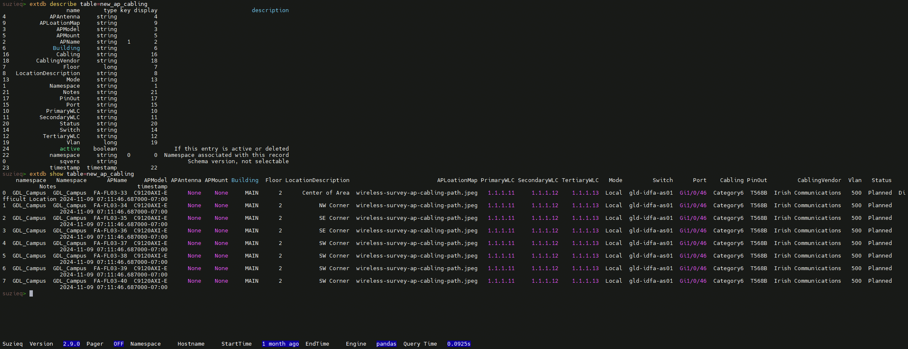
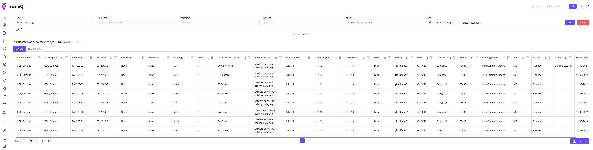

# Statement of Work for New Access Point Cabling

This mini project generates a Statement of Work suitable for quote solicitation from a Cabling Vendor for new cabling to support new Access Point locations at a location.

A challenge all Network Engineers face is that of storing design or change data in a queriable way.

SuzieQ Enterprise supports the integration of external data.  In this mini project we have data for new access point cabling runs in an SuzieQ External DB.  Once this external data is imported, the familiar methods, syntax, and interfaces used for other SuzieQ interactions can be used on this data.  It can also be updated over time, so updates can be tracked!

Imagine a world where, when asked "How many new runs did we need at GDL?"

**Everyone** answers 8!

and not:

"*I think it was 7 or 8...*"

...to which I like to resond.."*If you think, you don't know!*"

Rather than Little Joey answering 7 because he had an old version of the "design" file and Little Suzie answer 8 because she had the updated version and then everyone having to go figure out which is correct.

Using this feature, we will extract the latest new cabling data from the SuzieQ External DB `new_ap_cabling` and generate a detailed Statement of Work for a location.

```
uv run gen_sow.py -l
```

```
claudia@Claudias-MacBook-AirM415 08_SoW % uv run gen_sow.py -h
usage: gen_sow.py [-h] [-o OUTPUT_DIR] [-l]

Script Description

options:
  -h, --help            show this help message and exit
  -o OUTPUT_DIR, --output_dir OUTPUT_DIR
                        output directory Markdown procedure files. Default is output.
  -l, --local           Use local data file. Default: False

Usage: 'uv run gen_sow.py' or python gen_sow.py' Tip: Use python (rather than uv run) if you have activated your virtual
environment manualy'
claudia@Claudias-MacBook-AirM415 08_SoW %  
```


---


## SuzieQ Enterprise External DB






```bash
suzieq@customvm:~$ cd extdb_import_staging/
suzieq@customvm:~/extdb_import_staging$ ls
cleanup_critical_vlans.py  cleanup_new_ap_runs.py  gdl_new_ap_cabling.csv
suzieq@customvm:~/extdb_import_staging$ sq-import-data -i /home/suzieq/extdb_import_staging/gdl_new_ap_cabling.csv -t new_ap_cabling -n GDL_Campus -k 'APName' -c /home/suzieq/.suzieq/suzieq-cfg.yml -w /home/suzieq/extdb_import_staging/cleanup_new_ap_runs.py
Successfully imported file: /home/suzieq/extdb_import_staging/gdl_new_ap_cabling.csv with 8 rows and 23 columns in 0.1886s secs
suzieq@customvm:~/extdb_import_staging$
```

```
suzieqe@user:~/extdb_import_staging$ sq-import-data -h
DEPRECATION WARNING: This feature is no longer supported and will be removed in future update. Use the extdb import feature
usage: sq-import-data [-h] [-c CONFIG] [-i INPUT_FILE] [-d DELIMITER] [-V USE_VERSION] [-n NAMESPACE] -t TABLE_NAME [-k KEY_FIELDS] [--syntax-check]
                      [-l {ERROR,WARNING,INFO,DEBUG}] [-v] [-w CLEANUP_FILE] [-g GROUP]

options:
  -h, --help            show this help message and exit
  -c CONFIG, --config CONFIG
                        Controller configuration file
  -i INPUT_FILE, --input-file INPUT_FILE
                        File to import. CSV only, filename must end with .csv
  -d DELIMITER, --delimiter DELIMITER
                        Separator character for CSV, "," is default
  -V USE_VERSION, --use-version USE_VERSION
                        Version of CSV File, change only if schema changes
  -n NAMESPACE, --namespace NAMESPACE
                        Namespace to associate with CSV File
  -t TABLE_NAME, --table-name TABLE_NAME
                        Name of table to associate with file, keep it simple/short
  -k KEY_FIELDS, --key-fields KEY_FIELDS
                        comma separated ordered list of field names that are key
  --syntax-check        Check CSV file schema and such, don't import
  -l {ERROR,WARNING,INFO,DEBUG}, --log-level {ERROR,WARNING,INFO,DEBUG}
                        log level to use
  -v, --version         Print suzieq version
  -w CLEANUP_FILE, --cleanup-file CLEANUP_FILE
                        file containing the cleanup function if any
  -g GROUP, --group GROUP
                        linux user group
suzieqe@user:~/extdb_import_staging$

```


##### Example File and Schema

```csv

suzieq@customvm:~/extdb_import_staging$ cat gdl_new_ap_cabling.csv
Namespace,APName,APModel,APAntenna,APMount,Building,Floor,LocationDescription,APLoationMap,PrimaryWLC,SecondaryWLC,TertiaryWLC,Mode,Switch,Port,Cabling,PinOut,CablingVendor,Vlan,Status,Notes
GDL_Campus,FA-FL03-33,C9120AXI-E,None,None,MAIN,2,Center of Area,wireless-survey-ap-cabling-path.jpeg,1.1.1.11,1.1.1.12,1.1.1.13,Local,gld-idfa-as01,Gi1/0/46,Category6,T568B,Irish Communications,500
GDL_Campus,FA-FL03-34,C9120AXI-E,None,None,MAIN,2,NW Corner,wireless-survey-ap-cabling-path.jpeg,1.1.1.11,1.1.1.12,1.1.1.13,Local,gld-idfa-as01,Gi1/0/46,Category6,T568B,Irish Communications,500
GDL_Campus,FA-FL03-35,C9120AXI-E,None,None,MAIN,2,SE Corner,wireless-survey-ap-cabling-path.jpeg,1.1.1.11,1.1.1.12,1.1.1.13,Local,gld-idfa-as01,Gi1/0/46,Category6,T568B,Irish Communications,500
GDL_Campus,FA-FL03-36,C9120AXI-E,None,None,MAIN,2,SE Corner,wireless-survey-ap-cabling-path.jpeg,1.1.1.11,1.1.1.12,1.1.1.13,Local,gld-idfa-as01,Gi1/0/46,Category6,T568B,Irish Communications,500
GDL_Campus,FA-FL03-37,C9120AXI-E,None,None,MAIN,2,SW Corner,wireless-survey-ap-cabling-path.jpeg,1.1.1.11,1.1.1.12,1.1.1.13,Local,gld-idfa-as01,Gi1/0/46,Category6,T568B,Irish Communications,500
GDL_Campus,FA-FL03-38,C9120AXI-E,None,None,MAIN,2,SW Corner,wireless-survey-ap-cabling-path.jpeg,1.1.1.11,1.1.1.12,1.1.1.13,Local,gld-idfa-as01,Gi1/0/46,Category6,T568B,Irish Communications,500
GDL_Campus,FA-FL03-39,C9120AXI-E,None,None,MAIN,2,SW Corner,wireless-survey-ap-cabling-path.jpeg,1.1.1.11,1.1.1.12,1.1.1.13,Local,gld-idfa-as01,Gi1/0/46,Category6,T568B,Irish Communications,500
GDL_Campus,FA-FL03-40,C9120AXI-E,None,None,MAIN,2,SW Corner,wireless-survey-ap-cabling-path.jpeg,1.1.1.11,1.1.1.12,1.1.1.13,Local,gld-idfa-as01,Gi1/0/46,Category6,T568B,Irish Communications,500

```


---

## Modules

- Utils
