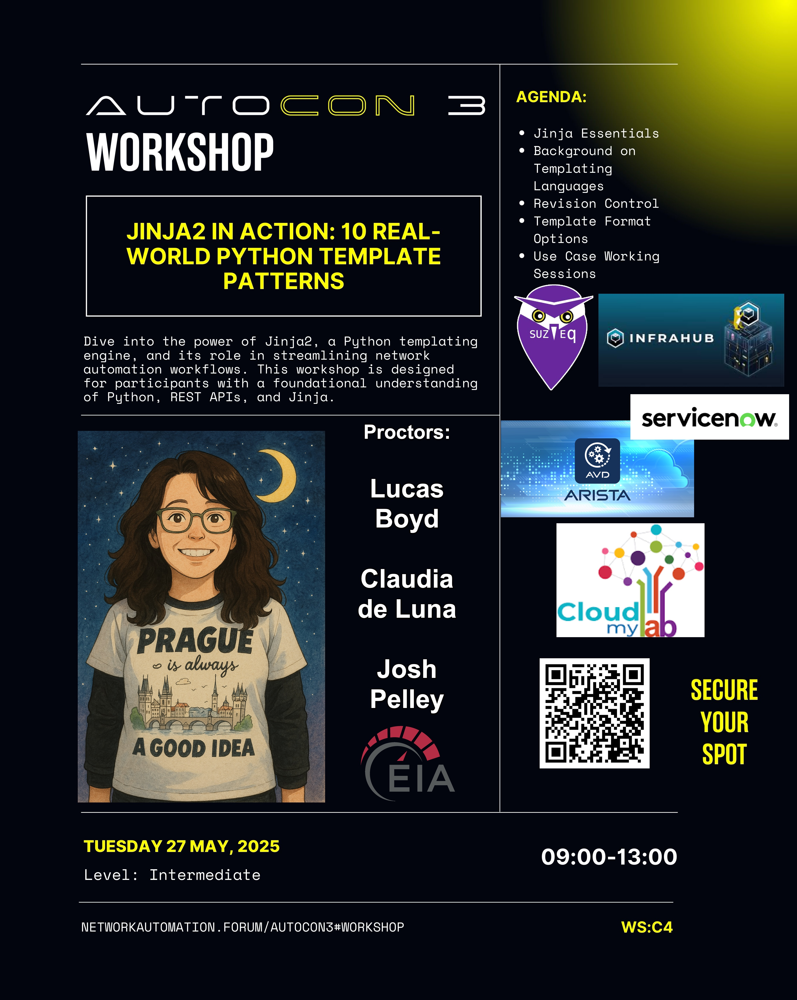

# NAF AutoCon3 Prague, Czech Republic 
# WS:C4 - Jinja2 in Action
Proctor: Claudia de Luna, EIA

Teaching Assistants:
- [Lucas Boyd](https://www.linkedin.com/in/lucas-l-boyd/)
- [Claudia de Luna](https://www.linkedin.com/in/claudiadeluna/)
- [Josh Pelley](https://www.linkedin.com/in/josh-pelley/)

## Workshop Attendee FAQ

Your hosts for this workshop:

- [NAF](https://networkautomation.forum/)
- EIA
  - [Lucas Boyd](https://www.linkedin.com/in/lucas-l-boyd/)
  - [Claudia de Luna](https://www.linkedin.com/in/claudiadeluna/)
  - [Josh Pelley](https://www.linkedin.com/in/josh-pelley/)

## ***\*What should I bring?\****

1. You will need a laptop with wireless suitable for cloning a GitHub Repository, running uv and  Python scripts 
2. You will need uv installed 
   1. [Installing UV](https://docs.astral.sh/uv/getting-started/installation/)
3. The workshop GitHub Repository (Cloned or Downloaded) prior to the workshop (in case we have connectivity issues)
   1. https://github.com/cldeluna/ac3-ws-c4-jinja2-in-action.git
4. Bring your favorite IDE. We will be using PyCharm Community Edition or Visual Studio Code if you don’t have a preference.
5. (Optional) Bring your favorite Markdown Viewer
   1. We like [Typora](https://typora.io/).  It cross platform (Mac, Linux, Windows) but there is a modest cost.  For our purposes there is a 15 day free trial.
   2. If you don't want another application, both PyCharm and VS Code will render Markdown well enough for our purposes.
6. (Optional) One example will build a Containerlab topology so if you want to spin it up on your own, you will need to have Containerlab installed and set up along with the Arista cEOS image downloaded.  There will also be an FRR topology as an alternative if you prefer not use cEOS.
   1. [Containerlab Quickstart](https://containerlab.dev/quickstart/)
   2. Arista Login (using a business email) to download cEOS
7. (Optional) One example builds a diagram using the diagrams module which requires Graphviz.  If that is not something you want to install, the working_directory has the image already created for you.

## *****\**Is there anything I should do before leaving for Prague?\*\******

1. Please join the workshop slack channel ***\*#ac3-ws-c4-jinja2-in-action\**** (we will be sharing updates there and that will be handy place for any questions you might have). 
2. Install uv and Test
   1. Execute the [workshop uv test repo](https://github.com/cldeluna/uv_it) 
   2. Make sure [uv is installed](https://docs.astral.sh/uv/getting-started/installation/) and you can execute the `uv --version` command and get output like below:
   3. `claudiadeluna in ~ % uv —versionuv 0.7.4 (6fbcd09b5 2025-05-15)`
3. Review the workshop [Introduction to Jinja2](https://vimeo.com/showcase/11692825) tutorial if you have not used Jinja2 before 
4. Clone the course repository 
   1. https://github.com/cldeluna/ac3-ws-c4-jinja2-in-action.git
5. If you prefer to not use uv:
   1. please make sure you can run Python (we will be using Python 3.12) and create virtual environments
   2. please build your virtual environment before the workshop using the `requirements.txt` file from the repo. We will post detailed instructions in the workshop Slack channel.

Think about use cases involving templates. Where could templates help you save time and/or improve accuracy/consistency? Are there complex configurations (or some other artifact) that could be challenging in a template?

Preview of the modules we will be using

- uv
- (Optional) Containerlab and ceos images
- (Optional) Graphviz Application and diagrams Python module 

\- pytz
\- jinja2
\- solara
\- pyyaml
\- pandas
\- requests
 \- diagrams
 \- openpyxl
 \- streamlit
 \- python-dotenv

### ***\*GraphViz Application\****

Note: The diagrams module requires the installation of the Graphviz application. (If this is not something you want to install the generated artifact is provided in the repo for your review)
[Diagrams Getting Started > Installation](https://diagrams.mingrammer.com/docs/getting-started/installation)
[Native installation for Windows Users without a package manager](https://forum.graphviz.org/t/new-simplified-installation-procedure-on-windows/224)
[Installation instructions for MacOSX, Windows10/11, and Linux](https://www.perplexity.ai/page/installing-graphviz-on-windows-fzF5FhQASHqTyyOYDD6ODQ)

The repository was developed on MacOSX and has also been tested on:

- Windows 10/11 natively and Windows Subsystem for Linux (WSLv2)

